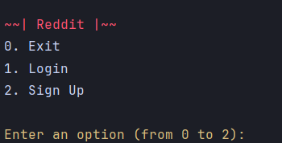
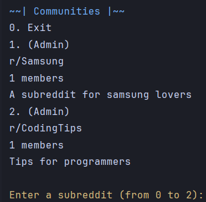
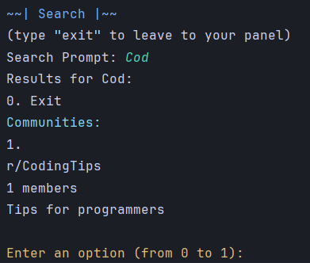

# Reddit (remastered)
***
## Table of Contents
* Description
* Usage
* Demos
* Credits
* Contact Information
***
### Description
Reddit is a social media platform and online community where registered members can submit content, which are then voted up or down by other users. Content is organized into topic-based communities called "subreddits," each focused on a specific theme or interest, such as technology, gaming, science, music, or cute animals.

Users can upvote content they find interesting or valuable, which increases its visibility and prominence on the platform, or downvote content that they think is irrelevant or low-quality. This democratic system of voting helps to surface the most popular and engaging content to the top of each subreddit or the site's front page.

In addition to voting, users can engage in discussions by commenting on posts, and they can also share their own content or contribute to ongoing conversations. Reddit fosters a sense of community through its discussion threads, allowing users to interact with each other, ask questions, share advice, and engage in debates.

### Usage
1. Clone the project from [*GitHub*](https://github.com/SrgtSajjad/Reddit.git)
2. Run the project
3. Enter inputs as asked
4. The rest of the application is self explanatory
!Attension! Make sure to exit the project correctly to save information 
### Demos
1. 
2. 
3. 
4. 
### Credits
* Developer: Mohammad Sajjad Zanganeh 
* Mentor: Rana Rokni
### Contact Information
* [*Telegram*](@SrgtSajjad)
* [*Email*](msajjad.za135@gmail.com)